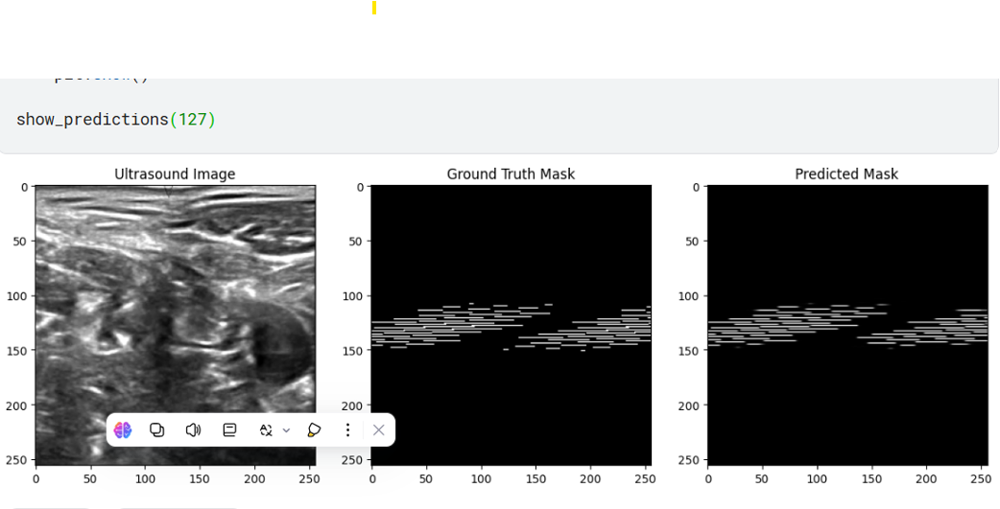

# 🏆 Deep Vision Showdown - Procom ‘25 | Team ADPM

## 🚀 Overview  
This repository contains our **Deep Learning-based segmentation model** developed for the **Deep Vision Showdown - Procom ‘25**, where **Team ADPM** secured **3rd place**! 🏅 

The project focuses on **improving post-surgical pain management** by accurately identifying **anatomical structures in medical sonography images** using **image segmentation techniques**.  

---

## 📌 Problem Statement  
Post-surgical pain management is a critical challenge in healthcare. Our goal was to develop a **deep learning model** capable of **segmenting anatomical structures** in sonography images, assisting in optimizing treatment and reducing reliance on heavy medications.

---

## 🔬 Methodology  

### 📊 **Dataset & Preprocessing**  
- **Sonography images** with expert-annotated ground truth.  
- Resized all images to **(448, 608)** for consistency.  
- Applied **image augmentations** (flipping, contrast adjustments) for better generalization.  
- Stored ground truth masks using **Run-Length Encoding (RLE)** for efficient storage.  

### 🧠 **Model Training**  
- **Deep Learning Model:** Trained over **100 epochs**.  
- **Loss Function:** Binary Cross-Entropy + Dice Loss.  
- **Optimizer:** Adam for precise weight adjustments.  
- **Evaluation Metric:** Dice Coefficient.  

### 📈 **Performance Highlights**  
- **Initial Dice Score:** 0.0302 → **Final Dice Score:** 0.8682  
- **Best Dice Score:** 0.8807 (Epoch 96)  
- **Training Loss Reduction:** 0.6052 → 0.3177  

### 📊 **Evaluation Metrics**  
- **Precision & Recall:** To measure segmentation reliability.  
- **Confusion Matrix:** Performance comparison between background & lesion regions.  
- **Classification Report:** Summarizing precision, recall, and F1-score.  

---

## 🖼️ Results  


 
---

## 🔮 Future Work  
We plan to enhance our segmentation model further by:  
✅ Implementing **U-Net++** or **DeepLabV3+** for advanced segmentation.  
✅ Exploring **attention mechanisms** to improve feature extraction.  
✅ Increasing **dataset diversity** to enhance model generalization.  
✅ Optimizing **inference time** for real-time clinical applications.  

---

## 🛠️ Setup & Installation  

### 📌 Prerequisites  
- Python 3.x  
- PyTorch / TensorFlow  
- OpenCV  
- NumPy  
- Matplotlib  

### 🔧 Installation  
Clone the repository:  
```bash
git clone https://github.com/SMH125194055/CV-Procom-Competition.git
cd deep-vision-showdown
